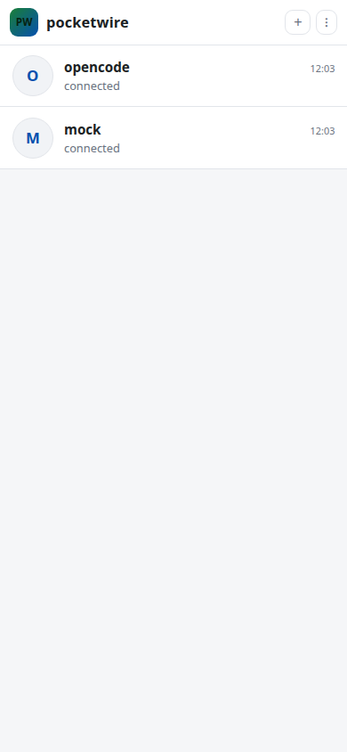
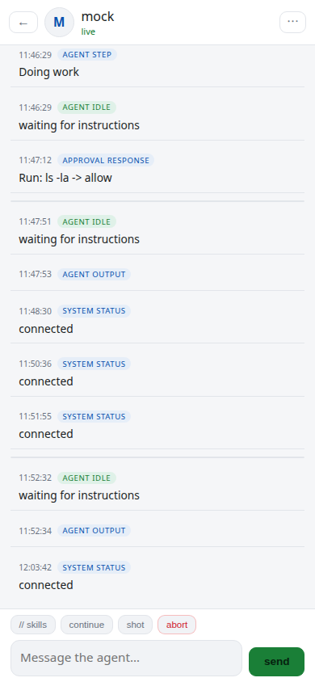
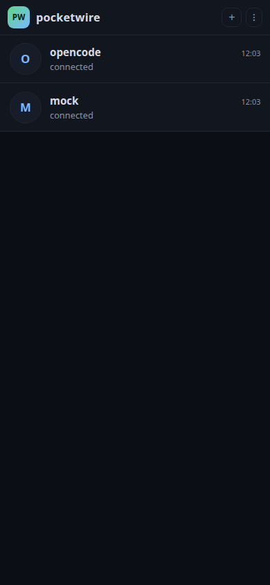
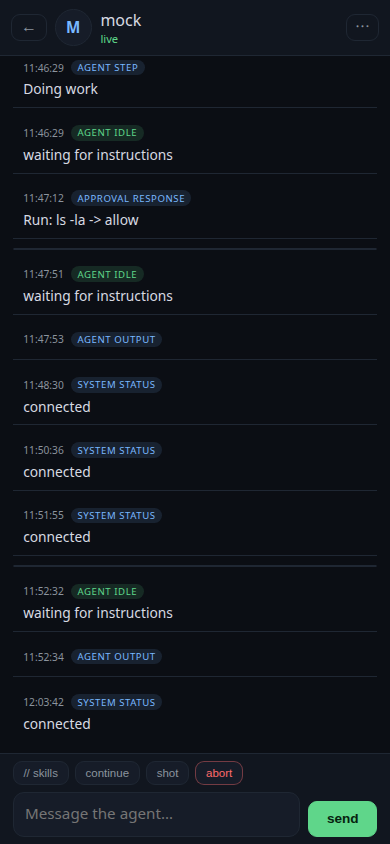
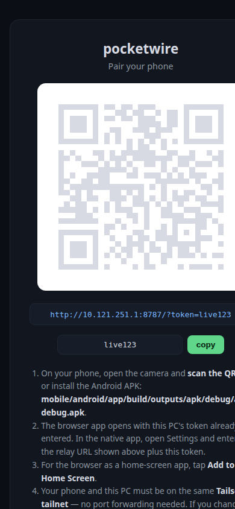

# pocketwire

Control and monitor your coding agents (opencode, Claude Code, Cursor, and more) from your phone — **one WhatsApp-style chat per agent**.

- **Chat list** — every agent on every paired laptop is a separate chat with an avatar, live status, last-message preview, and unread badges. Tap to open its feed.
- **Multi-agent & multi-laptop** — one relay can attach *N* opencode servers (on this machine or across your network); one phone (or many) can pair with all of them like WhatsApp contacts.
- **Light & dark mode** — switch in settings, or let it follow the system (auto).
- **Live activity feed** — every step, tool call, error, and result streams to the open chat in real time.
- **Prompt from anywhere** — type a message on your phone and it is injected into a *running* session of that agent.
- **Approve / deny** — answer permission requests (allow once, always, deny) from the couch.
- **Skills & slash commands** — browse your available skills and trigger them with a prompt (`/systematic-debugging`, superpowers, etc.).
- **Push alerts** — short, precise summaries via [ntfy](https://ntfy.sh), even over cellular.
- **Screenshots** — request a capture of the terminal / screen, or forward agent-generated images.
- **WhatsApp-style pairing** — scan a QR on the PC's pair page (or the terminal) and the phone connects in one tap.
- **Native Android app** — Capacitor wrapper of the PWA, installable APK (no browser needed).
- **Private by default** — binds to `127.0.0.1`, exposed only over Tailscale/LAN, token + PIN protected.

## Quick start

> Runs on **Linux, macOS, and Windows** (Node.js ≥ 22). Screen capture uses the platform tool: `grim`/`import`/`scrot` (Linux), `screencapture` (macOS), or PowerShell (Windows).

```bash
# 1. install (macOS/Linux)
git clone https://github.com/Prince000101/pocketwire && cd pocketwire
./scripts/setup.sh        # deps, config, optional systemd service
#    or, on any OS including Windows:
node scripts/setup.mjs

# 2. start the agents you want to control
opencode serve --port 4096     # deep opencode integration
#   + add the MCP server to opencode (~/.config/opencode/opencode.jsonc):
#   "pocketwire": { "type": "local", "command": ["node", "/abs/path/pocketwire/node_modules/tsx/dist/cli.mjs", "/abs/path/pocketwire/packages/mcp/src/index.ts"] }

# 3. start the relay
npm start                       # or: systemctl --user start pocketwire.service

# 4. pair your phone
#    open http://127.0.0.1:8787/pair on the PC and scan the QR —
#    or install the Android APK and enter the relay URL + token.
```

| Chat list — light | Chat — light |
|---|---|
|  |  |

| Chat list — dark | Chat — dark | Pair page |
|---|---|---|
|  |  |  |

## Installing on your phone

The relay exposes the PWA as an installable web app **and** ships a native Android app.

- **Native Android app (recommended):** on the PC, build the APK and copy it to the phone:

  ```bash
  cd mobile
  npm install && npx cap sync android
  cd android && ./gradlew :app:assembleDebug
  # APK: android/app/build/outputs/apk/debug/app-debug.apk
  ```

  Then open the app → enter the **relay URL** (e.g. `http://mypc.tailnet.ts.net:8787`) and the **access token** printed in the relay log. The iOS project is generated on a Mac with `npx cap add ios && npx cap open ios`.

- **Browser / home-screen app:** on the phone open the QR URL, then *Add to Home Screen* (Android Chrome / iOS Safari).

- **QR pairing:** set `publicUrl` in `~/.config/pocketwire/pocketwire.json`, e.g. `"publicUrl": "http://mypc.tailnet.ts.net:8787"`. Restart the relay — it prints a scanable QR in the terminal and on the local-only pair page (`http://127.0.0.1:8787/pair`). If `publicUrl` is unset the relay auto-detects a Tailscale hostname (`http://<host>.ts.net:<port>`).

## Remote access (Tailscale)

Install Tailscale on the PC and your phone and sign into the **same tailnet**. The relay detects the Tailscale interface and binds to it automatically (or set `host` in the config to override). No port forwarding, no `tailscale serve` needed:

```jsonc
// ~/.config/pocketwire/pocketwire.json
{
  "host": "0.0.0.0",              // optional — default auto-detects the Tailscale IP
  "publicUrl": "http://mypc.tailnet.ts.net:8787",   // optional — enables the QR
  // one chat per agent — attach as many opencode servers as you like
  "agents": [
    { "id": "main", "name": "opencode main", "kind": "opencode", "serverUrl": "http://127.0.0.1:4096" },
    { "id": "side", "name": "opencode side", "kind": "opencode", "serverUrl": "http://192.168.1.15:4096" }
  ]
}
```

With no `host`/`publicUrl` set the relay stays on `127.0.0.1` (local-only) — Tailscale/phone access is opt-in. If `agents` is omitted it defaults to a single agent pointed at `opencode.serverUrl` (or `http://127.0.0.1:4096`).

**Push alerts (ntfy):** set `"ntfy": { "topic": "<your-topic>" }` in the config (optionally a self-hosted `"server"`). Install [ntfy](https://ntfy.sh) on your phone and subscribe to the topic; the PWA picks up pushes automatically.

**Hardening:** set `"pin"` for a second factor, and limit which slash commands the phone may trigger with `"allowCommands": ["review", "test"]` (unset = all registered commands/skills allowed).

## Architecture

```
 Phone                        PC (localhost)                              Coding agents
┌─────────┐      HTTP/SSE     ┌────────────────────────────────────────┐   ┌─────────────┐
│ Web PWA │◄───Tailscale/QR──►│  pocketwire relay                      │◄─►│ opencode #1  │
│+Android │      + token      │  ├─ core: bus · queues · store · auth  │   │ opencode #2  │
│ APK     │                   │  ├─ server: HTTP + WS + SSE + PWA + CORS│   │ ... (one    │
│ +ntfy   │                   │  ├─ adapter-opencode × N (one per chat)│   │  chat each) │
└────┬────┘                   │  └─ mcp-server (stdio tools) ◄─────────┘   └─────────────┘
     │ ntfy.sh (alerts)       │
```

The relay speaks three integration dialects so it works with opencode deeply **and** with any other agent. The phone app renders one chat per agent, and the relay runs one opencode adapter per `agents[]` entry — each with its own session, event feed, and approval queue.

### 1. opencode adapter (deep integration)
Connects to the headless `opencode serve` API for:
- Real-time event streaming (`/event` SSE)
- Prompt injection into a running session (`/session/:id/prompt_async`)
- Slash commands & skills (`/session/:id/command`, `/command`)
- Permission approve/deny from the phone (`/session/:id/permissions/:id`)
- Abort, todos, and diffs

Enabled by adding the agent to `agents[]` in `pocketwire.json` (a single `opencode.serverUrl` still works and is treated as one agent). Start opencode with `opencode serve --port 4096` on the same machine (or reachable over your network); if a server password is set, export `OPENCODE_SERVER_PASSWORD`. Each adapter auto-selects the most recently active session, and events normalize into feed items (text streams, tool runs, approvals, idle/error pushes) tagged with their agent so the phone can route them to the right chat.

### 2. MCP server (any MCP-capable agent)
A stdio MCP server exposing tools any agent (Claude Code, Cursor, Windsurf, opencode) can call:
`notify`, `send_output` (short/precise, truncated), `send_screenshot`, `ask_user` (blocks until the phone answers), `get_instruction` (phone steering mid-run), `list_skills`, `report_done`.

Register it with any MCP client, e.g.:

```bash
# Claude Code
claude mcp add pocketwire -- node /abs/path/pocketwire/node_modules/tsx/dist/cli.mjs /abs/path/pocketwire/packages/mcp/src/index.ts
# Cursor / Windsurf: add a stdio MCP server with the same command
```

The server reads the relay address and bearer token from `~/.config/pocketwire/pocketwire.json` + `~/.pocketwire/.token`, so it works from any project directory once the relay is running.

### 3. PTY wrapper *(roadmap)*
`pocketwire run -- claude` — a generic wrapper for plain CLIs with no MCP/server support.

## Key flows

- **Monitoring:** agent finishes a step → `notify`/`send_output` or an opencode event → relay → live feed of that agent's chat (+ optional ntfy push). Open the PWA for full detail / screenshots.
- **Control:** type a prompt on your phone in the agent's chat → PWA → relay queue (routed to that agent) → opencode `prompt_async` into the active session (or the agent polls `get_instruction`).
- **Approvals:** opencode raises a permission request → relay relays it (tagged with the agent) → the phone shows **Allow once / Always / Deny** → tap → relay answers via `/session/:id/permissions/:id`.
- **Skills:** phone opens the picker → `GET /command` (opencode) or `list_skills` (scans `~/.agents/skills`, `~/.config/opencode/skills`, `~/.config/opencode/command`) → tap a skill → executes as a slash command with your prompt.
- **Screenshots:** phone button → relay → captures the screen (scrot on X11 / grim on Wayland) or forwards agent-generated images.

## Repository layout

```
packages/
  core/                 # event bus, queues, event store, auth, ntfy push, net (tailscale/QR)
  server/               # HTTP + WebSocket + SSE API, CORS, QR pair page, serves the PWA
  adapter-opencode/     # opencode serve API integration
  mcp/                  # MCP server exposing tools to any agent
  web/                  # phone PWA (vanilla JS, installable)
mobile/                 # Capacitor wrapper: android/ (APK) + ios/ (generated on a Mac)
docs/
  DESIGN.md             # full design document
  architecture/         # ARCHITECTURE.md + diagrams (PNG/SVG/dot)
  TODO.md               # roadmap / task list
```

## Phases

| Phase | What | Status |
|-------|------|--------|
| 0–1   | Monorepo scaffold + relay core + server + auth + ntfy push | done |
| 2     | Phone PWA (feed, prompt, skills, actions, approvals, screenshots) | done |
| 3     | opencode adapter (events, prompt injection, commands, approvals, abort) | done |
| 4     | MCP server tools, wired into `opencode.jsonc` / `claude mcp add` | mostly done |
| 5     | QR pairing + pair page, Tailscale auto-binding, native Android app (Capacitor) | done |
| 6     | Multi-agent relay + WhatsApp-style chat UI, light/dark themes, per-agent routing | done |
| 7     | Telegram add-on + PTY wrapper for any CLI | stretch |

## Security posture

- Binds to `127.0.0.1` by default; reachable only via **Tailscale**.
- Phone access requires a bearer token, optionally a PIN.
- Remote-initiated commands are gated by an **allowlist** (prompts + skills OK; raw shell off by default).

## License

MIT
