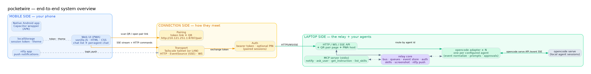
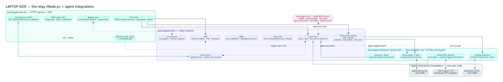
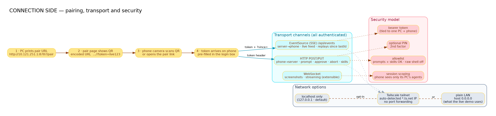
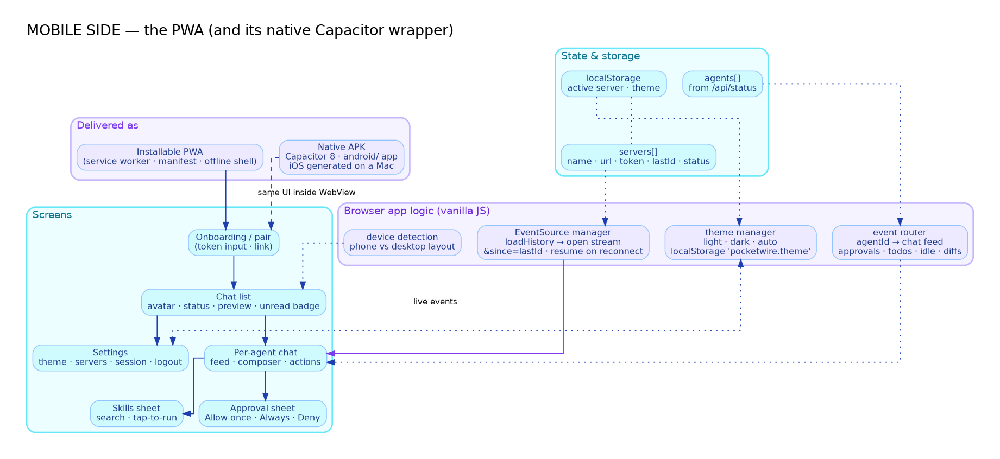
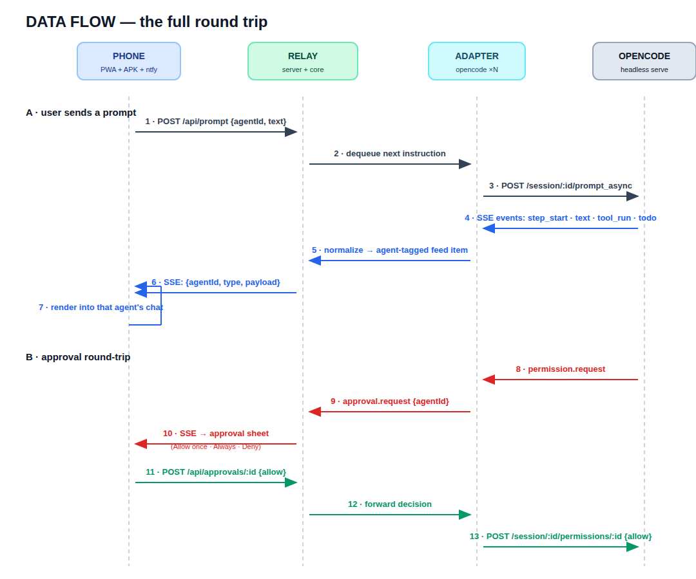
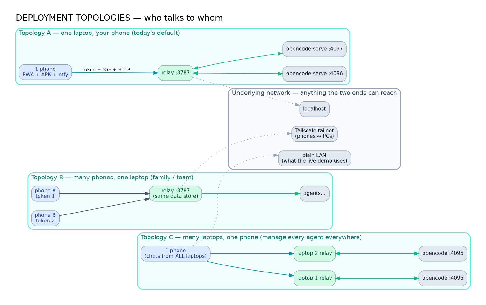
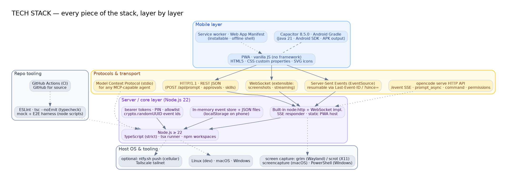
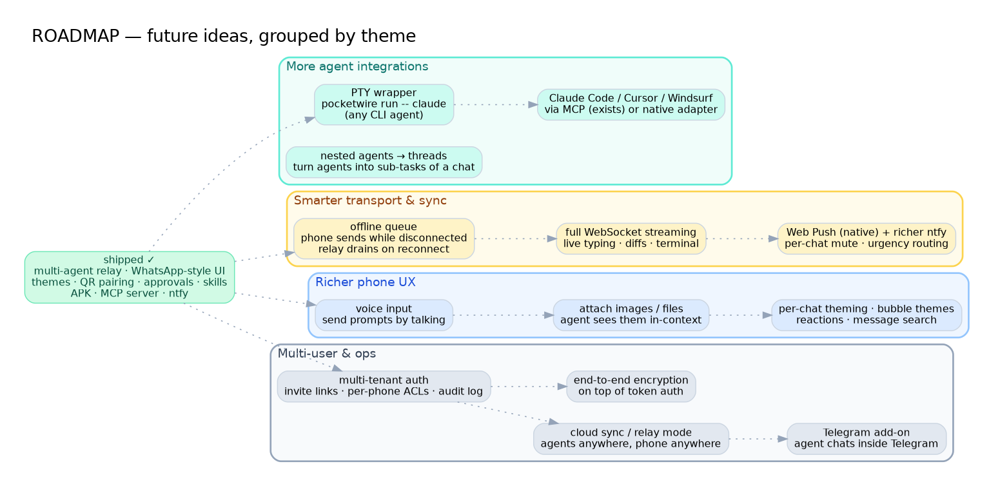

# pocketwire — Architecture

> Control and monitor every coding agent (opencode, Claude Code, Cursor, …) from your phone.
> One **WhatsApp-style chat per agent**. This document explains the full system: the phone side, the connection side, and the laptop side, plus the tech stack, the key data flows, deployment topologies, and the roadmap.

**Diagrams** (SVG and PNG) live in [`diagrams/`](diagrams/). The PNGs are embedded below.

| # | Diagram | What it shows |
|---|---------|---------------|
| 01 | [System overview](diagrams/01-system-overview.svg) | Everything at a glance |
| 02 | [Laptop side](diagrams/02-laptop-side.svg) | The relay + agent integrations |
| 03 | [Connection side](diagrams/03-connection-side.svg) | Pairing, transport, security |
| 04 | [Mobile side](diagrams/04-mobile-side.svg) | The PWA + Capacitor app |
| 05 | [Data flow](diagrams/05-data-flow.svg) | End-to-end round trips (sequence) |
| 06 | [Deployment](diagrams/06-deployment.svg) | Topologies: phone↔laptop combos |
| 07 | [Tech stack](diagrams/07-tech-stack.svg) | Every technology, layer by layer |
| 08 | [Roadmap](diagrams/08-roadmap.svg) | Future ideas, grouped |

---

## 1 · System overview



Three zones, one product:

- **Mobile side** — your phone. A vanilla-JS PWA (also wrapped as a native Android app) shows a chat list of every connected agent, live feeds per agent, approval sheets, a skills picker, settings (including **light/dark/auto themes**), and push alerts via ntfy.
- **Connection side** — how the two ends meet. Pairing is WhatsApp-style: the PC prints a pair URL, the page (or terminal) shows a QR, the phone scans it and is handed the relay URL + token. Transport is HTTP + **resumable SSE** (and WebSocket for future streaming) over localhost, Tailscale, or plain LAN.
- **Laptop side** — the relay (Node.js) plus the agent processes it controls. The relay runs **one opencode adapter per configured agent**, so each agent is a fully independent chat with its own session, event feed, instruction queue, and approval queue.

---

## 2 · Laptop side — the relay



The laptop side is a TypeScript monorepo (npm workspaces) with four packages.

### `packages/server` — HTTP server, API, PWA host
- REST routes: prompt, approve/deny, abort, skills, screenshot, status.
- `GET /api/events` — an **SSE stream** the phone subscribes to. Events carry a monotonically increasing id; the phone resumes with `Last-Event-ID` / `?since=<lastId>`, so reconnects replay only what the phone missed.
- `GET /pair` — the QR pair page (plus a terminal QR printed on boot).
- WebSocket endpoint (used for extended streaming; screenshot transfer planned).
- Serves the PWA static files + service worker.

### `packages/core` — the relay engine
- **Event bus** — pub/sub fan-out: every event is pushed to all subscribed phones.
- **Event store** — append-only; events are replayed from a `since` id, never lost mid-stream.
- **Per-agent queues** — `prompt`, `command`, `ask_user` instructions are queued per agent so a phone can drive a busy session.
- **Auth** — bearer token, optional PIN, paired-session scoping.
- **Skills** — scans `skillsDirs` (`~/.agents/skills`, `~/.config/opencode/skills`, `~/.config/opencode/command`), **deduped by name**, searchable from the phone.
- **Screenshot** — platform screen capture (grim/scrot/screencapture/PowerShell).
- **ntfy push** — short summaries over cellular when the phone is away.

### `packages/adapter-opencode` — one adapter per agent
Each `agents[]` entry gets its own adapter instance that:
- subscribes to the agent's `/event` SSE and **normalizes** every event (text streams, tool runs, todos, diffs, idle/error) into **agent-tagged** feed items;
- injects prompts via `/session/:id/prompt_async`;
- runs slash commands / skills via `/session/:id/command`;
- answers permission requests via `/session/:id/permissions/:id` (Allow once / Always / Deny).

### `packages/mcp` — the MCP server
A stdio **Model Context Protocol** server any MCP-capable agent (Claude Code, Cursor, Windsurf, opencode) can call: `notify`, `send_output`, `send_screenshot`, `ask_user`, `get_instruction`, `list_skills`, `report_done`.

> A generic **PTY wrapper** for plain CLIs (`pocketwire run -- claude`) is the roadmap path to controlling agents with no server/MCP support.

---

## 3 · Connection side — pairing, transport, security



### Pairing (WhatsApp-style)
1. The relay boots and logs the pair URL `http://<host>:8787/pair`.
2. The pair page renders a **QR** encoding `http://<host>:8787/?token=<token>` (also printed in the terminal).
3. The phone camera scans it — the browser app opens **with the token pre-filled**.
4. In the native app you enter the relay URL + token in Settings once; it is stored on the phone.

### Transport
| Channel | Direction | Purpose |
|---------|-----------|---------|
| **SSE (EventSource)** | server → phone | live feed, replay since `lastId` |
| **HTTP (REST/JSON)** | phone → server | prompt, approve, abort, skills, status |
| **WebSocket** | both (extensible) | screenshots, streaming (roadmap) |
| **ntfy** | server → phone (out-of-band) | cellular push alerts |

### Security model
- Binds to `127.0.0.1` by default — Tailscale/phone access is opt-in.
- **Bearer token** per relay; optional **PIN** as a second factor.
- Session scoping: a phone sees only its paired PC's agents.
- **Allowlist**: prompts + skills allowed; raw shell off by default.

---

## 4 · Mobile side — the PWA (+ native wrapper)



A dependency-free vanilla JS app (no framework, no build step) — the PWA is served straight from the relay.

### Screens
- **Onboarding / pair** — token entry, pair link.
- **Chat list** — one row per agent: avatar (initial), live status (connected/idle/…), last-message preview, unread badge, sorted by most recent event.
- **Per-agent chat** — only that agent's events; composer to send a prompt; action buttons (`/` skills, continue, screenshot, abort).
- **Approval sheet** — **Allow once · Always · Deny** when the agent asks permission.
- **Skills sheet** — searchable list; **tap-to-run** triggers the skill with your prompt.
- **Settings** — **light / dark / auto** theme, connected servers (laptops), session picker, logout.

### App logic
- **EventSource manager** — on load: fetch history → open the stream with `?since=lastId` → resume on reconnect; updates `lastId` from `Last-Event-ID` on every message (so a stale `approval.request` from a replay never re-shows the approval sheet).
- **Event router** — routes each event to the right chat by `agentId` (approvals, todos, idle, diffs, text, tools).
- **Theme manager** — `light` / `dark` / `auto`, persisted in `localStorage` (`pocketwire.theme`), applied as a `data-theme` attribute.
- **Device detection** — phone vs desktop layout.

### Delivery
- **Installable PWA** — service worker + web app manifest (installable, offline shell).
- **Native Android app** — a Capacitor 8 wrapper of the same UI (APK output; iOS generated on a Mac).
- **ntfy app** — push notifications when the PWA is closed.

---

## 5 · Data flow — end-to-end round trips



**A · User sends a prompt**
1. `POST /api/prompt {agentId, text}` → relay validates the token.
2. Relay **dequeues the next instruction** for that agent.
3. Adapter calls `/session/:id/prompt_async`.
4. opencode streams events (`step_start`, `text`, `tool_run`, `todo`).
5. Adapter normalizes them into **agent-tagged** feed items.
6. Relay pushes them over SSE `{agentId, type, payload}`.
7. The phone renders them into that agent's chat.

**B · Approval round-trip**
8. Agent raises `permission.request`.
9. Adapter relays it as `approval.request {agentId}`.
10. Phone shows the approval sheet (**Allow once / Always / Deny**).
11. Phone answers `POST /api/approvals/:id`.
12. Relay forwards the decision to the right adapter.
13. Adapter calls `/session/:id/permissions/:id` with the verdict.

---

## 6 · Deployment topologies



- **A — One laptop, one phone** *(today's default)*: one relay, one or more agents on the PC, your phone. Works on localhost, Tailscale, or LAN.
- **B — Many phones, one laptop**: multiple phones pair to one relay with their own tokens; all watch the same agents.
- **C — Many laptops, one phone**: the phone pairs to *every* laptop's relay and gets **one chat list spanning all of them** — every agent on every machine in one app.

The underlying network is flexible: localhost-only (default), a **Tailscale tailnet** (auto-detected `*.ts.net` IP, no port forwarding), or a plain LAN (`host: "0.0.0.0"` — how the live demo runs).

---

## 7 · Tech stack



| Layer | Technology |
|-------|-----------|
| **Mobile** | PWA: vanilla JS + HTML5 + CSS (custom properties, SVG icons) · service worker · web manifest · **Capacitor 8.5.0** (Android Gradle, Java 21, Android SDK) |
| **Protocols** | HTTP/1.1 + JSON · **Server-Sent Events** (resumable via `Last-Event-ID`) · WebSocket · **Model Context Protocol** (stdio) · opencode serve HTTP API |
| **Server/core** | **Node.js ≥ 22** · **TypeScript (strict)** · tsx runner · npm workspaces · built-in `node:http` + WebSocket · in-memory event store + JSON files · `crypto.randomUUID` event ids |
| **Host OS** | Linux (dev) · macOS · Windows · screen capture via grim/scrot/screencapture/PowerShell · optional Tailscale + ntfy.sh |
| **Repo tooling** | ESLint · `tsc --noEmit` typecheck · mock + E2E harness scripts · GitHub Actions CI · GitHub |

---

## 8 · Key design decisions

- **One adapter per agent → one chat per agent.** The relay scales to *N* opencode servers (local or remote) without coupling; routing is by `agentId` everywhere.
- **SSE with replay, not WS-only.** EventSource auto-reconnects and carries `Last-Event-ID`, which is exactly the "I missed everything while the tab was backgrounded" use case for phone apps. WS is kept for things SSE can't do.
- **`since` = `Last-Event-ID` header wins over the `?since=` param**, so a reconnect can never double-deliver or re-show stale approval sheets.
- **Skills dedupe by name** across multiple `skillsDirs` so the same skill shipped in two directories appears once.
- **No framework, no build step** on the phone side — the PWA is static files the relay serves, keeping the deploy surface tiny and the app instant.

---

## 9 · Future ideas (roadmap)



**More agent integrations**
- `pocketwire run -- claude` — a generic **PTY wrapper** for plain CLIs.
- First-class Claude Code / Cursor / Windsurf adapters (MCP path already works).
- Nested agents → **threads**: turn sub-agents into threads inside a chat.

**Smarter transport & sync**
- **Offline queue** — phone sends while disconnected; relay drains on reconnect.
- Full **WebSocket streaming** — live typing, diffs, terminal.
- **Web Push** + richer ntfy: per-chat mute, urgency routing.

**Richer phone UX**
- **Voice input** — send prompts by talking.
- **Attach images/files** — the agent sees them in-context.
- Per-chat theming, bubble themes, reactions, message search.

**Multi-user & ops**
- **Multi-tenant auth**: invite links, per-phone ACLs, audit log.
- **Cloud sync / relay mode** — agents anywhere, phone anywhere.
- **End-to-end encryption** on top of token auth.
- **Telegram add-on** — agent chats inside Telegram.

---

## 10 · Repository layout

```
pocketwire/
  packages/
    core/                 # event bus, queues, event store, auth, skills, ntfy, net
    server/               # HTTP + WS + SSE API, QR pair page, serves the PWA
    adapter-opencode/     # one adapter per agent (events, prompts, approvals)
    mcp/                  # MCP server (stdio tools for any agent)
    web/                  # phone PWA (vanilla JS, installable)
  mobile/                 # Capacitor wrapper: android/ (APK) + ios/ (generated on a Mac)
  docs/
    DESIGN.md             # product design document
    architecture/         # this document + diagrams/
    TODO.md               # roadmap / task list
```
